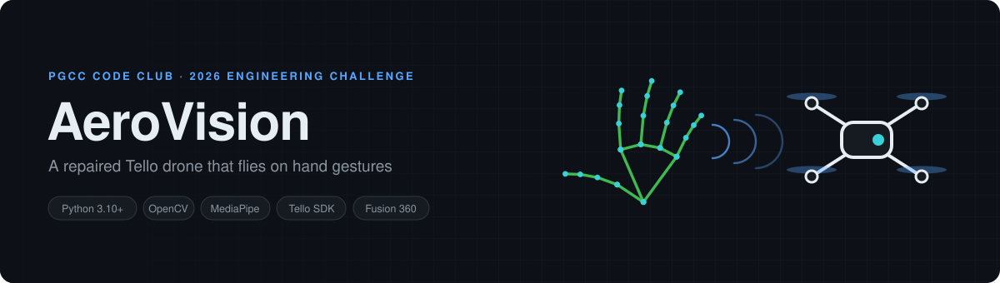
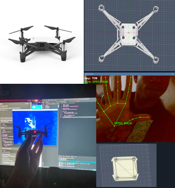
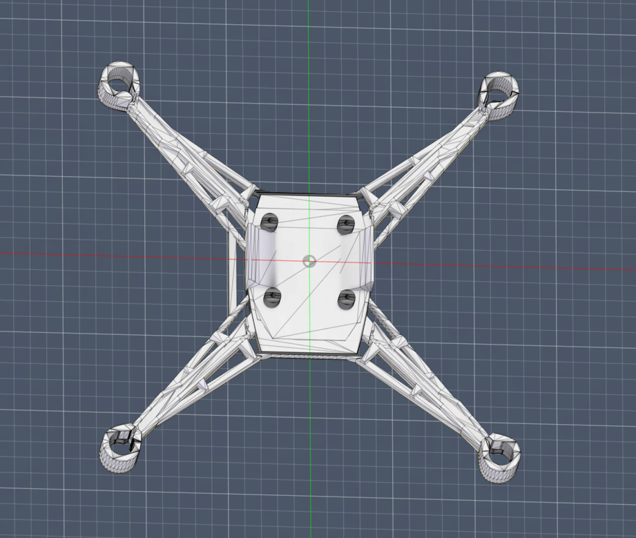
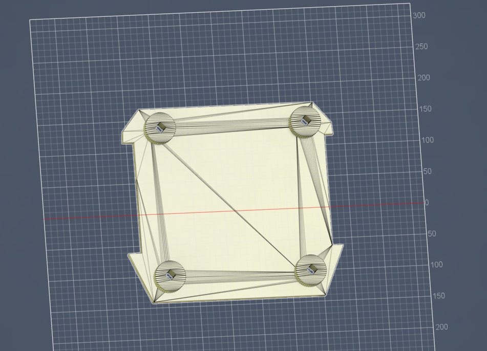

## Repairing and Reprogramming a Gesture-Controlled Imaging Drone
**2026 CODE Club Engineering Challenge @pgcc**

AeroVision restores and reprograms a broken Ryze Tello Drone by DJI into a Python-controlled aerial imaging drone with live camera view, keyboard flight control, photo capture, and video recording. The final target is a gesture-controlled interface using computer vision from a connected camera, plus a lighter custom 3D-printed frame to reduce heat and improve portability.


The original idea was to build a tiny autonomous spider-style drone that could hover, take pictures, record video, and respond to hand gestures. Because the timeline was only three weeks, I pivoted to repairing an old drone first and turning it into a programmable prototype that could realistically be finished on time.

## Project Thumbnail


## What I repaired
- Replaced battery setup with new **1100mAh 3.8V** batteries
- Added a **USB-C charging dock**
- Bought replacement **brushed motors** to keep cost low and soldered it into the original frame
- Verified that the drone could fly correctly again before coding

## What works now
- Python connection to the Tello over Wi-Fi
- Live camera window in OpenCV
- Keyboard flight control
- Photo capture from the live feed
- Video recording from the live feed
- Gesture recognition through computer vision
- Hand gesture mapping to flight commands

## Currently work in progress
- Lightweight custom frame redesign in Fusion 360
- Better airflow and weight reduction to address overheating

## The gestures


My webcam looks at my hand, MediaPipe gives back 21 points, and I check if a finger is up by measuring the fingertip and the middle knuckle from the wrist. Those 5 flags get looked up in a table to get the command. It waits until the same gesture wins most of the last 0.7 seconds before doing anything, because my hand goes through a fist on the way to an open palm and I didn't want it landing on me. More on it in [docs/GESTURES.md](docs/GESTURES.md).

## How to run it
Connect to the drone's `TELLO-XXXXXX` wifi network first.

```
pip install -r requirements.txt

python -m aerovision handcheck      # practice the gestures, no drone needed
python -m aerovision fly --dry-run  # reads gestures but doesn't fly
python -m aerovision fly            # the real thing
python -m aerovision camera         # just the camera view
python -m aerovision keyboard       # wasd control
python -m aerovision preflight      # battery and wifi check
```

The hand model downloads itself the first time you need it. Use `--dry-run` until the gestures feel right, and it won't take off under 15% battery since a Tello that dies mid command drops instead of landing.

## Design process
I modeled the drone in Fusion 360 using real measurements from the drone and compared them against the published dimensions to keep the frame accurate. I created two versions: the first included raised leg features but added too much weight and was scrapped, while the second version focused on a smaller, lighter body with more open areas for airflow.

 

The STL files and the rest of my build notes are in [docs/HARDWARE.md](docs/HARDWARE.md).

## Biggest challenges
1. **Overheating** after several minutes of operation or near the end of battery life, which caused delayed or laggy movement on the next startup.
2. **Scope control** because building a fully custom drone from scratch was too expensive and difficult for the deadline.
3. **3D printing fit issues** because the second frame was accidentally scaled too large before printing, which made the propeller arms too long to swap in safely.
4. **Software debugging** while moving from basic control scripts to gesture recognition.
5. **Blue photos** because everything I saved came out blue until I found out the drone sends RGB frames and OpenCV expects BGR.

## What is in this repo
```
src/aerovision/   gestures, hand tracking, drone control, the cli
tests/            tests for the gesture logic, no drone or camera needed
tools/            the scripts that draw the banner and the gesture chart
hardware/         STL files and Fusion 360 renders
docs/             gesture and hardware notes
```

I had a separate script for every feature and they kept drifting apart from each other, so I put them all into one package. That's how I found out two of my gestures could never run, since photo and rotate right had the same conditions as backward and rotate left in my if chain.

## I learned that...
- It is better to get a working prototype first, then expand features.
- Mechanical design decisions directly affect flight performance and heat.
- Small scaling mistakes in CAD can completely change motor and propeller geometry.
- Python, OpenCV, and drone SDK control can turn a consumer drone into a programmable robotics platform.

## If I had more time
- Finish gesture-controlled flight
- Resize and reprint the V2 frame accurately
- Tune the thermal design and test airflow changes
- Add a final lightweight shell inspired by the spider-drone concept art

## Demo Video and Presentation!
https://drive.google.com/file/d/1S9KgXW-gF6EoA1r2D0iLO95KVfs6CO_E/view?usp=sharing

[AeroVisionProject.pptx](https://github.com/user-attachments/files/26882107/AeroVisionProject.pptx)

## Credits
Built by D.A. Hand tracking is Google MediaPipe, drone control is djitellopy. The spider idea came from Spider-Man: Far From Home. Minimal use of AI
