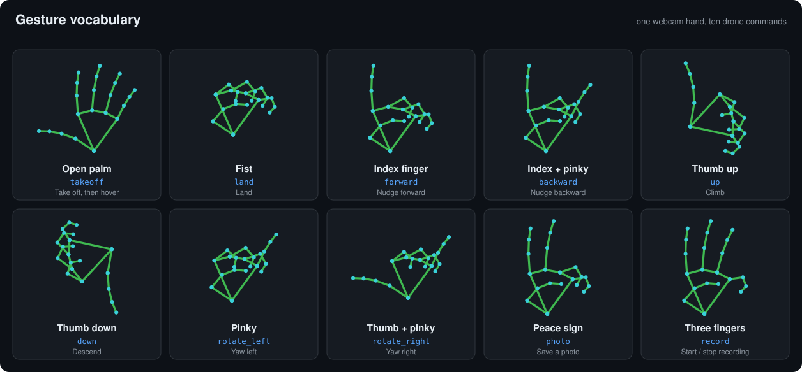

# Gestures

Notes on how a webcam frame turns into a drone command, and how to add a new gesture later.



## The list

`python -m aerovision gestures` prints this same table.

| Hand shape | Command | What the drone does |
| --- | --- | --- |
| Open palm | `takeoff` | Take off, then hover |
| Fist | `land` | Land |
| Index finger | `forward` | Nudge forward |
| Index + pinky | `backward` | Nudge backward |
| Thumb up | `up` | Climb |
| Thumb down | `down` | Descend |
| Pinky | `rotate_left` | Yaw left |
| Thumb + pinky | `rotate_right` | Yaw right |
| Peace sign | `photo` | Save a photo |
| Three fingers | `record` | Start / stop recording |

Anything else is `NONE` and the drone just keeps hovering.

## How it decides

MediaPipe gives back 21 points for the hand. I turn those into 5 true/false flags before deciding anything, which keeps it simple enough to actually test.

```
        8   12  16          for each finger I use the tip
        |   |   |  20       and the middle knuckle (PIP),
    4   7   11  15 |        both measured from the wrist (0)
     \  6   10  14 19
      3  \  |   |  |
       2  5--9--13-17
        \    \  |  /
         1----- 0            0 = wrist
```

**Is the finger up?** A curled finger folds back toward the palm, so the tip ends up closer to the wrist than its own middle knuckle:

```python
distance(tip, wrist) > distance(pip, wrist) * 1.05
```

My first version just compared the tip and the knuckle up and down. That only works while my hand is straight up, so tilting my wrist made every finger read as up and a thumbs down was impossible. Measuring from the wrist fixed it, and the tests tilt the hand 40 degrees each way to check.

**Is the thumb out?** The thumb goes sideways instead of curling so it gets its own check. A tucked thumb sits closer to the index knuckle than the joint it hangs off of.

**Look it up.** The 5 flags make a key like `(False, True, True, False, False)` for a peace sign, and `GESTURE_SPECS` in [gestures.py](../src/aerovision/gestures.py) maps keys to commands. It refuses to build if two commands claim the same hand shape. This used to be a chain of ifs and two of them could never be reached, `photo` had the same condition as `backward` and `rotate_right` had the same one as `rotate_left`, so those two gestures just did nothing.

**Vote before moving.** `GestureStabilizer` keeps the last 0.7 seconds of guesses and only fires the one that wins, then blocks new commands for 2 seconds. That's what stops my hand passing through a fist on the way to an open palm from landing the drone.

## Settings

Defaults are in [config.py](../src/aerovision/config.py), the ones I change most have flags:

| Setting | Default | Flag | What it changes |
| --- | --- | --- | --- |
| `speed` | 30 | `--speed` | how hard the stick gets pushed for one nudge |
| `nudge_seconds` | 0.35 | | how long a nudge lasts before it hovers again |
| `command_cooldown` | 2.0 | `--cooldown` | minimum gap between commands |
| `vote_window` | 0.7 | | how much history the vote looks at |
| `min_votes` | 4 | | votes needed before a command counts |
| `min_takeoff_battery` | 15 | | won't take off under this |
| `camera_index` | 0 | `--camera` | which webcam is watching me |

If commands fire too easily raise `min_votes`, if flying feels sluggish lower `command_cooldown`. `python -m aerovision handcheck` shows the live finger pattern and the command with no drone connected, that's the easiest way to test either one.

## Adding a gesture

1. Add a `Gesture` member and a `GestureSpec` row in `gestures.py`
2. Handle it in `apps/fly.py::_apply`, or put it in `MOTION_GESTURES` if it's just a nudge
3. Run `pytest`, the new row gets tested on its own and the ambiguity test fails if that hand shape is taken
4. Run `python tools/render_gesture_chart.py` to redraw the chart

## If tracking isn't working

| What happens | Why | What to do |
| --- | --- | --- |
| No hand detected | backlighting, or hand too far | face a light, keep your hand about 40-80 cm from the webcam |
| Commands feel late | the vote window plus the cooldown | hold the shape still for about a second |
| Wrong command | shapes that look alike, like three fingers and an open palm | run `handcheck` and see which fingers register |
| Timestamp error from `detect_for_video` | two frames in the same millisecond | already handled, `hands.py` bumps the timestamp |
